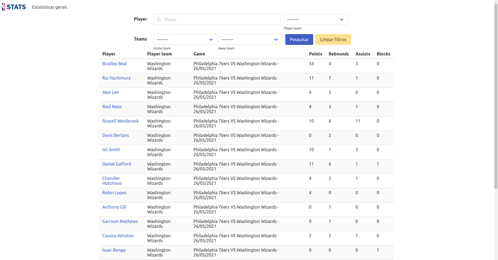

# PD_NBA_Stats_Analyser

**Número da Lista**: 2<br>
**Conteúdo da Disciplina**: Programação dinâmica (Maior Subsequência crescente)<br>

## Alunos
|Matrícula   |               Aluno                  |
| ---------- | ------------------------------------ |
| 15/0132590 |      João Vitor Ramos de Souza       |

## Sobre 

O PD_NBA_Stats_Analyser tem como objetivo analisar estatísticas de jogadores da NBA ao recuperar a **Maior Subsequência crescente** de acordo com um dos critérios de análise utilizados na estatística. No projeto foi utilizado o seguinte [dataset do Kaggle](https://www.kaggle.com/nathanlauga/nba-games) contendo estatísticas de jogos da NBA de 2004 até 2020 para recuperar as estatísticas dos jogos da NBA.

## Screenshots
1. Página inicial da aplicação com texto explicando o objetivo do projeto


2. Página com as estatísticas gerais dos jogadores


3. Página com as estatísticas e a **Maior Subsequência crescente**  de um jogador específico


## Instalação 
**Linguagem**: Python<br>
**Framework**: Django<br>

Pré-requisitos para rodar o **PD_NBA_Stats_Analyser**:

É necessário ter o Python (versão 3.8.x), Pip e docker-compose instalados em seu sistema operacional.

Instale as dependências do Python no seu sistema operacional com o seguinte comando:
```sh
$ git clone https://github.com/projeto-de-algoritmos/PD_NBA_Stats_Analyser.git
$ cd PD_NBA_Stats_Analyser
$ pip3 install -r requirements.txt
```

Também é necessário ter um banco de dados Postgres sendo executado e para isso foi adicionado o docker-compose para se facilitar a criação do ambiente. Com o docker-compose instalado, basta executar o seguinte comando:

```sh
$ docker-compose up
```

**Importante:** O comando `docker-compose up` irá inutilizar o terminal aberto, para se subir o container do banco de dados em bacground, basta executar o comando `docker-compose up -d`

Realize as migrações do banco de dados com o seguinte comando:
```sh
$ python manage.py migrate
```

Para facilitar a primeira execução do projeto, foi adicionado o arquivo `dump.json` com um arquivo `json` para carregar as estatísticas da temporada 2020 da NBA. Para ter os dados serem adicionados a base de dados execute o seguinte:

Carregando dados:
```sh
$ unzip dump.zip
$ python manage.py loaddata dump.json
```


Suba o servidor Django com o comando abaixo:
```sh
$ python manage.py runserver
```

## Uso 

1. Com todos os comandos de instalação já executados, abra seu navegador em `http://localhost:8000/`
2. Após isso, basta acessar `http://localhost:8000/stats` para visualizar as estatísticas gerais dos jogadores.
3. Para visualizar a página contendo a **Maior Subsequência crescente** de um jogador basta clicar no link presente no nome do jogador, localizado na primeira coluna da tabela.
4. Com isso será o navegador será aberto em `http://localhost:8000/stats/player/<player_id>` com as estatísticas do jogador selecionado

## Outros

Caso não queira utilizar os dados da temporada de 2020 da NBA, existe um comando disponível para carregar estatísticas de outra temporada. Para isso, é necessário adicionar o terceiro parâmetro `season` na chamada da função `parse_games_data` no [seguinte arquivo](analyser/management/commands/dump_nba_games.py) contendo um número de uma temporada da NBA (entre 2004 e 2020) e executar os seguintes comandos:

```sh
$ unzip datasets.zip
$ python manage.py dump_nba_games
```

